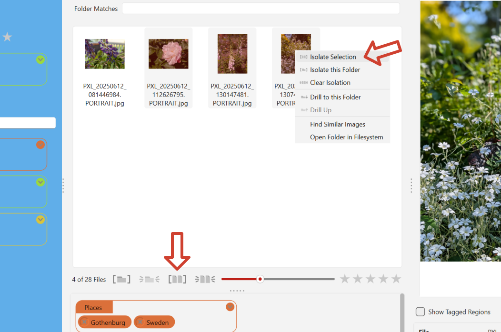

# Filtering and Navigation

## Overview

Compendia implements several types of filtering: by tags, by star rating, by file or folder name, and by capture date. All active filters work simultaneously, so you can combine them to pinpoint exactly the files you need.

## Tag Filters

The **Tag Filter** area is the upper-left panel in the main window. Drag and drop tags here to narrow the displayed files to only the ones with certain tags.

<figure><figcaption></figcaption></figure>

Active filters are shown as colored tags grouped by family, using the same visual style as the Tag Library and Tag Assignment area. Note under the file list we have a filtered view showin 4 out of a total of 28 files.

To remove a filter, just click the **×** button on the tag, being careful to do it in the filter area and not the library. The tag will disappear from the filter set and the files displayed will no longer be restricted to that tag.

## Filter with Multiple Tags

One of the more powerful ways to filter is to stack multiple tags in the filter.

When more than one tag filter is active, compendia can apply them together, using either OR or AND logic.&#x20;

Example: if you have tags for years, you could place 2024 and 2025 into the filter area to see only photos taken in 2024 _or_ 2025 but not other years. Here you would set the filter preference just above the tags to "Show files with **ANY** of these tags." ("or" filter.)

Alternatively, if you have tags for People and Events and Places, you could add "Meredith," "European Vacation," and "Germany" to show only pictures of Meredith, in Germany, during the European Vacation. Here set the filter preference to "Show files with **ALL** of these tags." ("and" filter.)

## Removing a Filter

To remove a tag filter, just click the **×** button on the tag in the Tag Filter area. The file list updates to reflect the remaining filters, if any, or the whole set.

To clear all active filters at once, you can use **Filter > Clear All Filters**. This removes all tag filters, as well as any active star rating, folder or file name, and date filters. It does not affect the tags assigned to your files.

## Folder Navigation

Your photos may be organized into multiple subfolders on disk. When a parent folder is loaded, Compendia shows all files from that folder and its subfolders - but you can use a **folder filter** to restrict the file list to just one portion of your files. For example, if you have a folder from each time you uploaded images from your camera or phone, you might want to restrict the view in compendia to one of those folders, perhaps just the last one.&#x20;

There are several ways to do this:

* You can locate one image that you know to be in that subfolder, right-click on it, and choose **Isolate this Folder**.
* Or you can select that image and click the **Isolate Folder** button below the list.
* You can even just type a unique part of that folder name into the **Folder Matches** field.

<figure><figcaption></figcaption></figure>

The filters will be set to show only images that have a matching folder name (and subfolders within, if any), isolating a subset of your images which you can tag in isolation.

To remove the folder isolation filter, there is a **Clear Isolation** command in the same menu, and a **clear button** in the tool bar, next to the Isolate Folder button.

## Combining Tag Filters with Folder Navigation

Tag filters and folder navigation work together. You can select a subfolder to limit the scope to that location, then add tag filters to narrow further within it. You can also set tag filters first and then navigate into a subfolder. Either way, the file list always reflects all active filters at once.

## Advanced: Isolating Sets of Files

Compendia provides three methods for focusing on a specific subset of files. Each is suited to a different situation.

### Selection Isolation

Selection isolation temporarily filters the file list down to exactly the files you select. To use it, select the files you want to work with using **click**, **ctrl+click**, or **shift+click**, then activate selection isolation. The file list will show only those files until you clear the isolation.

**Isolate Selection** is available in the right-click menu and as a button below the file list:

<figure><figcaption></figcaption></figure>

This is useful when you need to apply a unique set of tags to a specific group of files that do not share a common folder location or other tag. For example, you might hand-pick 20 files from across your library and then tag them, without affecting anything else.

This is also very handy for removing tags that were applied to the wrong files. Select and then isolate the images for tag removal, and then use the **×** button in the tag assignment area to remove the tags from the set.

### Folder Isolation

Folder isolation, also described above, filters the file list to the folder that a specific file belongs to, including its subdirectories. To use it, right-click a file and choose **Isolate Folder**. The file list will update to show only files in that folder and below.

This is a quick way to focus on a particular location in your folder tree without having to navigate to it manually. To clear folder isolation, use the clear folder isolation button or the corresponding menu command. If you also want to clear any other active filters at the same time, use **Filter > Clear All Filters**.

### Drill

**Drill** is designed for very large projects where keeping the entire library in memory is slow or impractical. Rather than just _filtering_ the view, drill physically opens a subfolder as if it were its own project, unloading everything outside that location from memory. This frees up resources and makes working with that portion of the library faster:

<figure><figcaption></figcaption></figure>

Each folder in compendia is modular and self-contained, with its own tag data, so you can drill into any subfolder and work on it independently. For example, in a project with 50,000 images across 600 folders, you might drill into a section covering one year or one location, work through it, and then move on to another section. To move back up through the folder tree, use the **Drill Up** button. This moves up one directory level at a time, up to the root folder where you originally opened the project.
