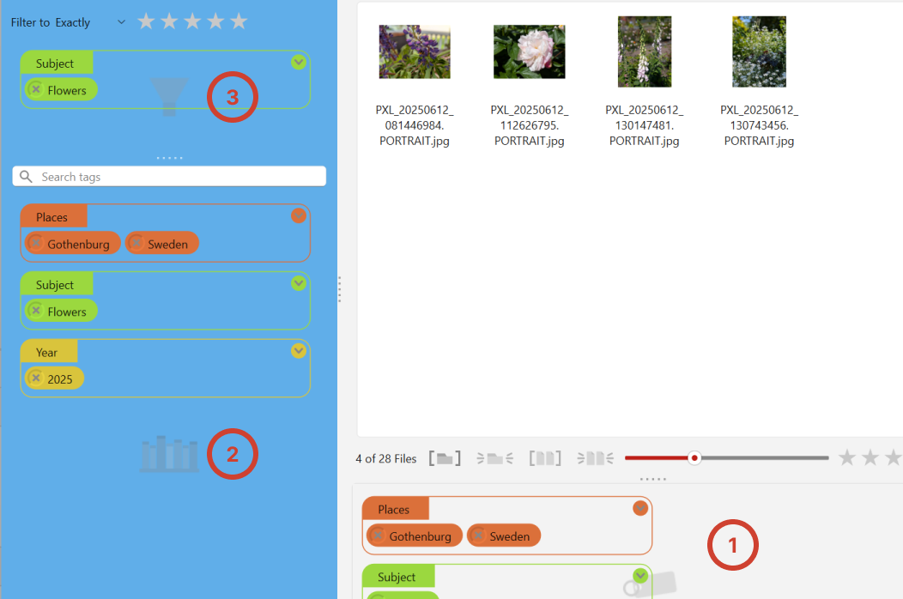

# Tagging Files

<figure><figcaption></figcaption></figure>

## Overview

Tags are at the core of how compendia helps you organize your media. Rather than relying on folder structure alone, you can attach any number of descriptive tags to each file, and use those tags to filter and find exactly what you're looking for. Tags are incredibly flexible: a single photo can have multiple tags from multiple families, where using only a folder structure limits you to placing each image in a single folder.

## Tag Families and Tags

Compendia organizes tags into groups, called families, instead of just a single, long list.

**Tag Families** are groups of tags. A family might represent a broad category like _People_, _Events_, _Locations_, or _Year_. Each family has a name and a color, which is used to visually distinguish its tags throughout the interface.

**Tags** belong to a family and represent specific values within that category. For example, the _People_ family might contain tags like _Susan_, _Bill_, _Mom_, while the _Events_ category might contain _Paris Vacation_ and _Maddy's Wedding_.

This two-level structure keeps your tag library organized as it grows, and makes it easy to scan through and find or apply tags quickly. When you filter your images you can use combinations of tags, for example to find pictures of _Susan_, taken in _2025_, at _Maddy's Wedding_.

## Creating a Tag&#x20;

1. Click in any empty area of the **Tag Library,** below the Search tags box, to make a new family.
2. Type a name for the family and press _Enter_.
3. A new tag will appear inside the family. Type a name for the tag and press _Enter._

<figure><figcaption></figcaption></figure>

Add additional tags within any family just by clicking in an empty area inside the family. To make more families, click in an empty area of the **Tag Library**.

## Applying Tags

### Drag and Drop onto Files

The most direct way to tag a file is to drag a tag from the Tag Library and drop it onto a file in the file list.

1. Click a file in the **File List** to select it.
2. Find the tag you want to apply in the **Tag Library**.
3. Click and drag the tag, then drop it onto the file thumbnail.

<figure><figcaption></figcaption></figure>

The tag is applied immediately and appears in the **Tag Assignment** area below the file list. This area always shows all the tags that are applied to any visible file in the file list.

### Applying a Tag to Multiple Files at Once

To tag several files in one action:

1. Select multiple files using **Ctrl+click** (to add individual files) or **Shift+click** (to select a range).
2. Drag a tag from the Tag Library and drop it into the Tag Assignment area.

The tag is applied to every file in the selection. The Tag Assignment area shows all tags that are common to the selected files.

### Drag and Drop into the Tag Assignment Area

You can also apply a tag by dropping it into the Tag Assignment area on the right side of the window. This is useful when you have multiple files selected and want to apply a tag to all of them at once.

1. Select one or more files in the file list.
2. Drag a tag from the Tag Library and drop it into the Tag Assignment area.

The tag is applied to all currently selected files.

## Tag Colors

Each tag family is automatically assigned a color, which is used for its tags throughout the interface, including the Tag Library, the Tag Assignment area, and the Tag Filters area. Colors make it easy to identify which family a tag belongs to at a glance.

## Renaming Tags

To rename a tag, just click its name. You can modify the name right in place, and the change will apply thoughtout your entire project. All existing assignments throughout the open folder are updated automatically, so you do not need to re-tag your files to apply the new name.

## Removing or Deleting Tags

Removing and deleting tags are related but separate concepts. For our purposes, _removing a tag_ from a file just means to remove the assignment. The tag itself will remain in your project, and will stay assigned to any _other_ files that had that tag.

On the other hand, _deleting_ a tag is much more destructive - a tag that is deleted will be removed from _all files_ it was assigned to in the open project, and permanently deleted.

Removing or deleting tags happens with the **×** button on the tag itself, but the result depends on where you do that. There are three distinct areas where you may see tags:

<figure><figcaption></figcaption></figure>

1 is the **Tag Assignment** area, with an icon of a tag in the background. Clicking the **×** button here, as you may have intuited, **unassigns** the tag from any files that are showing in the list above.

2 is the **Tag Library,** with the bookshelf icon in the background. This is the master list of tags for your whole project. Clicking the **×** button here will remove a tag from all files in the open folder and from the library itself.

3 is the **Tag Filter** area. Clicking the **×** button here will just remove the tag from the filter area, but will not have any effect on files or tags otherwise.

To remove a tag from files, you click the **×** button on the tag in the **Tag Assignment** area (1). The tag is removed from _all files that are currently visible_ on screen, i.e. all files matching the active filters.&#x20;


If you want to remove a tag from only a subset of your files, or from one file, apply [filters](filtering-and-navigation.md) first to narrow the visible set before clicking **×**. You can filter by tag, but also by name, by folder location, by date, or to specific selected files. See the [filters](filtering-and-navigation.md) page for details.


To completely delete a tag from your whole project, click the **×** button in the **Tag Library**. When you delete a tag, it is removed from all files it was assigned to in the open folder. This cannot be undone, so take care when deleting tags that have been widely applied.
